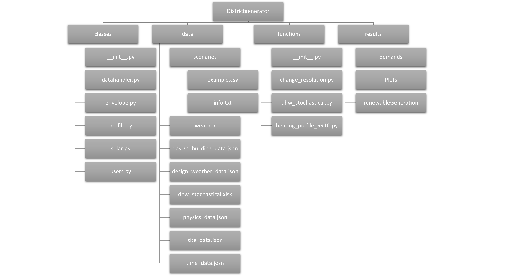
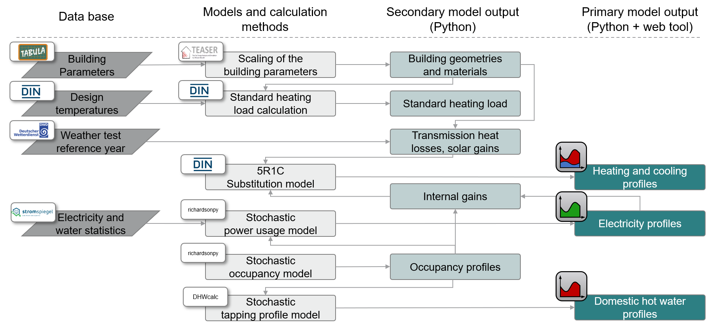

# DistrictGenerator

[](http://doge.mit-license.org)

Through the DistrictGenerator, we introduce an python-based open-source tool aimed at urban planners, energy suppliers,
housing associations, engineering firms, architectural professionals, as well as academic and research institutions. 
This tool furnishes crucial insights into energy demands, pivotal for the effective design and operation of 
neighborhoods energy systems. Consequently, users can discern actionable measures to harmonize energy supply.
The DistrictGenerator offers a pioneering approach by mapping entire urban 
building stocks in neighborhood models for automated load profile calculations and dimensioning of distributed 
energy resources. By integrating several open-source data bases and tools like [TEASER](https://github.com/RWTH-EBC/TEASER) 
and [richardsonpy](https://github.com/RWTH-EBC/richardsonpy).

The DistrictGenerator is being developed at [RWTH Aachen University, E.ON Energy
Research Center, Institute for Energy Efficient Buildings and Indoor
Climate](https://www.ebc.eonerc.rwth-aachen.de/cms/~dmzz/E-ON-ERC-EBC/?lidx=1).

## General Motivation

In the early stages of neighborhood planning, crucial data such as demand profiles of electricity, heating, 
domestic hot water, and occupancy profiles are often not available. The absence of this data hampers 
accurate evaluations of energy systems in districts. The DistrictGenerator seeks to advance the applicability 
of sustainable, cross-sectoral energy systems in neighborhoods, with a specific emphasis on exploiting synergy 
potentials among buildings of diverse usage structures through integrated concepts. We summarize the key contributions 
of the DistrictGenerator as follows:

- An open-source tool with minimal input requirements. Leveraging pre-set elements and default values of temporally 
  resolved demand profiles, as well as decentralized heat generator sizing conforming to DIN standards.

- The tool enables the bottom-up representation of entire urban structures through neighborhood models, affording a 
  sufficiently detailed analysis foundation.

- Facilitation of central operational optimization and presentation of analytical results and key performance 
  indicators. This supports the examination of various neighborhood types and supply scenarios concerning technology 
  selection and penetrations. We thereby create a platform for early-stage comparison of neighborhood concepts 
  with the flexibility of selecting different variants, given the tool's rapid recalculations.


## Getting started

### Install the DistrictGenerator

To install, first clone this repository with
```
git clone https://github.com/RWTH-EBC/districtgenerator
```
and secondly run:
```
pip install -e districtgenerator
```

Once you have installed the DistrictGenerator, you can check the [examples](docs/EXAMPLES.md) 
to learn how to use the different components.

### Minimum manual required input data

To generate your district, you need to know some information about its buildings. 
The minimal input data set was defined following the [TABULA archetype approach](https://webtool.building-typology.eu/#bm):

- id: building ID (just numerate the buildings)
- building: residential building type (single family house, terraced house, multi family house or apartment block)
- year: construction year (the calendar year in which the building was constructed)
- retrofit: retrofit state according to TABULA (0: existing state, 1: usual refurbishment, 2: advanced refurbishment)
- area: reference floor area (given in square meters)

The example.csv file can be used as [template](../districtgenerator/data/scenarios/example.csv).

### Additional input data

In the folder [data](https://github.com/RWTH-EBC/districtgenerator/tree/JOSS_submission/districtgenerator/data) 
further data can be found. Default values are already stored there.
Optionally, the following data can be changed to:
- design_building_data.json: Maximum and minimum indoor temperature and the room ventilation rate
- site_data.json: Test referece year and its conditions, 
- time_data.json: The time resolution of the profiles 

The data in the following files must not be changed because they are fixed parameters and external data:
- design_weather_data.json: Contains the 16 German climate zones of the DWD. Climate zones are large areas 
in which the main characteristics of the climate are the same. Each zone is represented by a city.
- physics_data.json
- dhw_stochstical.xlsx

The weather data can be found in [weather](https://github.com/RWTH-EBC/districtgenerator/tree/JOSS_submission/districtgenerator/data/weather).

## Structure of the DistrictGenerator



## Workflow of the DistrictGenerator

The district generator integrates multiple open-source tools and databases. 
The figure below visualizes the dependencies of external tools and data with internal 
functions. The user input for the parameterization of a neighborhood consists 
of a minimum of data. First, the user enters the number of buildings and basic 
information about each building, namely the building type, year of construction, 
retrofit level, and net floor area. The number of buildings to be calculated is 
not limited by the program. Optionally, the site of the district, the time 
resolution of the profiles and the test reference year (TRY) for weather data 
can be modified.



To obtain a fully parameterized building model, the [TEASER tool](https://rwth-ebc.github.io/TEASER/main/docs/index.html) 
performs a data enrichment with data from the [TABULA WebTool](https://webtool.building-typology.eu/#bm) 
that provides statistical and normative information about the building stock. 
Finally, the TEASER python package determines the geometry and material properties of the buildings. 
As the TABULA WebTool defines archetypal building properties for type, age class and retrofit level, the 
generated districts are composed of representative buildings, making them ideal 
for representative analyses or scalability studies. A number of residents is randomly, 
but within defined limits, attributed to each dwelling and serves as input data for the [richardsonpy tool](https://github.com/RWTH-EBC/richardsonpy) 
to calculate the time-resolved occupancy profiles. 
Furthermore, the [Stromspiegel](https://www.stromspiegel.de/fileadmin/ssi/stromspiegel/Downloads/Stromspiegel-2019-web.pdf) 
provides statistical data on annual electricity consumption in German households. Annual consumption
is stochastically assigned to each building, upon which the time-resolved electricity profile is
created using the stochastic profile generator richardsonpy again. The electricity and occupancy
profiles serve as input for a time-resolved internal gain calculation. Additionally, the occupancy
profiles are needed for stochastic domestic hot water profile generation, for which functions from the
[pyCity tool](https://github.com/RWTH-EBC/pyCity/tree/master) 
are utilized. Finally, the static building data, as well as the time-resolved weather and internal gain data, 
are included in the space heating profile generation. These are computed by means of a 5R1C-substitution model 
according to DIN EN ISO 13790:2008-09 using the simplified hourly method.

## Final output of the DistrictGenerator

Including all these tools the DistrictGenerator gives as output time-resolved demand profiles 
as csv. file for each building in the neighborhood. The output contains: 

- heat: space heating demand
- dhw: domestic hot water demand
- elec: electricity demand for lighting and electric household devices
- gains: internal gains from persons, lighting and electric household devices
- occ: occupancy profile

All csv files are finally saved in the [demands](https://github.com/RWTH-EBC/districtgenerator/tree/JOSS_submission/districtgenerator/results/demands)
folder. The unit of the demand profiles is watt.


## Running examples for functional testing

Once you have installed the DistrictGenerator, you can check the [examples](docs/EXAMPLES.md) 
to learn how to use the different components. 

To test the tool's executability, run [test_examples.py](https://github.com/RWTH-EBC/districtgenerator/tree/JOSS_submission/tests)  in the tests folder. 
This functional testing checks the entire chain of the tool, from data input and 
initialization to the output of the calculated profiles. It does not correspond to a 
test of the functional units of the entire process. This  functional testing is based 
on the examples automatically executed one after another.

## How to contribute

The documentation and examples should be understandable and the code bug-free. 
As all users have different backgrounds, you may not understand everything or encounter bugs.
If you have questions, want to contribute new features or fix bugs yourself,
please [raise an issue here](https://github.com/RWTH-EBC/districtgenerator/issues/new).

If you wrote a new feature, create a pull request and assign 
a reviewer before merging. Once review is finished, you can merge.

## Authors

* [Joel Schölzel](https://www.ebc.eonerc.rwth-aachen.de/cms/e-on-erc-ebc/das-institut/mitarbeiter/digitale-energie-quartiere/~obome/schoelzel-joel/?allou=1) (corresponding)
* [Tobias Beckhölter](https://www.ebc.eonerc.rwth-aachen.de/cms/E-ON-ERC-EBC/Das-Institut/Mitarbeiter/Team6/~scaj/Beckhoelter-Tobias/)
* [Carla Wüller](https://www.ebc.eonerc.rwth-aachen.de/cms/E-ON-ERC-EBC/Das-Institut/Mitarbeiter/Digitale-Energie-Quartiere/~beoyus/Wueller-Carla/)
* [Rawad Hamze](https://www.ebc.eonerc.rwth-aachen.de/cms/e-on-erc-ebc/das-institut/mitarbeiter/team6/~birwyf/hamze-rawad/?lidx=1)

## Alumni

* Sarah Henn

## Reference

We presented or applied the library in the following publications:

- J. Schölzel, S. Henn, R. Streblow, D. Müller. Evaluation of Energy Sharing on a 
  Local Energy Market Through Comparison of Energy Management Techniques. 36th International 
  Conference on Efficiency, Cost, Optimization, Simulation and Environmental Impact of Energy Systems.
  https://doi.org/10.52202/069564-0307

- J. Schölzel, T. Beckhölter, S. Henn, C.Wüller, R. Streblow, D. Müller.
  Districtgenerator: A Novel Open-Source Webtool to Generate Building-Specific Load 
  Profiles and Evaluate Energy Systems of Residential Districts. 37th International 
  Conference on Efficiency, Cost, Optimization, Simulation and Environmental Impact of 
  Energy Systems.
  
- C. Wüller, J. Schölzel, R. Streblow, D. Müller. Optimizing Local Energy Trading in Residential Neighborhoods:A Price Signal Approach 
  in Local Energy Markets. 37th International Conference on Efficiency, Cost, Optimization, 
  Simulation and Environmental Impact of Energy Systems.

## License

The DistrictGenerator is released by RWTH Aachen University, E.ON Energy
Research Center, Institute for Energy Efficient Buildings and Indoor Climate,
under the [MIT License](about/LICENSE.md).

## Acknowledgements

The districtgenerator has been developed within the public funded project 
"BF2020 Begleitforschung ENERGIEWENDEBAUEN - Modul Quartiere" (promotional reference: 03EWB003B) 
and with financial support by BMWK (German Federal Ministry for Economic Affairs and Climate Action).


