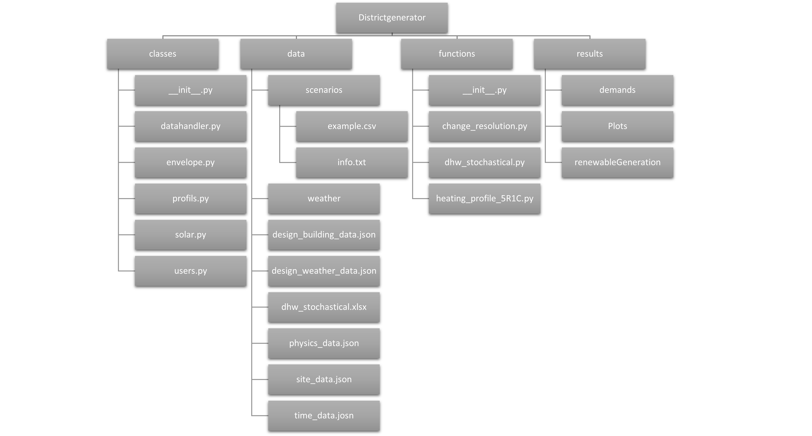
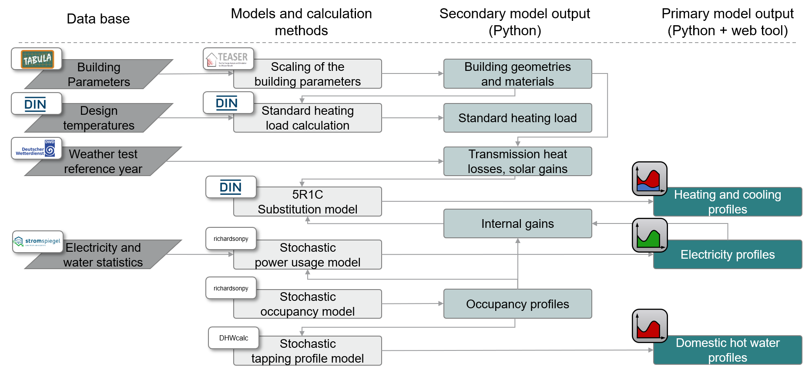

## Updated `README.md` (English, with Berlin Heat Cadastre getting started)


# DistrictGenerator

[](http://doge.mit-license.org)
[](https://rwth-ebc.github.io/districtgenerator/master/docs/README.html)

DistrictGenerator is a Python-based open-source tool aimed at urban planners, energy suppliers,
housing associations, engineering firms, architectural professionals, and academic/research institutions.
It provides crucial insights into energy demands for the effective design and operation of neighborhood
energy systems. Users can derive actionable measures to harmonize energy supply.

DistrictGenerator maps entire urban building stocks into neighborhood models for automated load profile
calculations and the dimensioning of distributed energy resources. It integrates several open-source
databases and tools such as [TEASER](https://github.com/RWTH-EBC/TEASER) and
[richardsonpy](https://github.com/RWTH-EBC/richardsonpy).

DistrictGenerator is developed at
[RWTH Aachen University, E.ON Energy Research Center, Institute for Energy Efficient Buildings and Indoor Climate](https://www.ebc.eonerc.rwth-aachen.de/cms/~dmzz/E-ON-ERC-EBC/?lidx=1).

---

## General Motivation

In the early stages of neighborhood planning, crucial data such as demand profiles of electricity, heating,
domestic hot water, and occupancy profiles are often not available. The absence of this data hampers
accurate evaluations of energy systems in districts. DistrictGenerator advances the applicability of
sustainable, cross-sectoral neighborhood energy systems, with a specific emphasis on exploiting synergy
potentials among buildings of diverse usage structures through integrated concepts.

Key contributions:

- An open-source tool with minimal input requirements, leveraging default values for temporally resolved
  demand profiles and decentralized heat generator sizing conforming to DIN standards.
- Bottom-up representation of entire urban structures through neighborhood models, enabling sufficiently
  detailed analyses.
- Support for comparing neighborhood concepts quickly (technology selection/penetrations) via fast
  recalculations and KPI-ready outputs.

---

## Getting started

### 1) Install the DistrictGenerator

Clone the repository:

```bash
git clone https://github.com/RWTH-EBC/districtgenerator
```

Install in editable mode:

```bash
pip install -e districtgenerator
```

---

### 2) Getting started: Berlin Heat Cadastre (Berliner Wärmekataster)

This section describes the workflow for the **Berlin project branch** and the required input data handling.

#### 2.1 Clone the Berlin project branch

```bash
git clone -b Projekt_berlin https://github.com/RWTH-EBC/districtgenerator
```

#### 2.2 Use the Berlin project run file

Once you have installed the DistrictGenerator, you can check the [run file](examples/run_file_Berlin.py). 
This should be used for the Berlin project. 

#### 2.3 Minimum manual required input data (Berlin: scenario CSV vs. WKB export CSV)

To generate a district, you must provide building information. For the Berlin workflow there are **two valid ways**
to provide inputs:

**Option A — Provide a DistrictGenerator scenario CSV directly**  
Create a single scenario CSV that contains (at minimum) the required fields listed under
“Minimum manual required input data” below.

**Option B — Export from the Berlin heat cadastre and map to DistrictGenerator scenario format**  
Export the heat cadastre data to CSV and ensure it contains at least the fields listed below. 
If you only have a gpkg export, you can convert it to CSV using [this file](functions/gpgk_to_csv.py)

Depending on which option you use, set the variable in the Berlin run file:

- In `examples/run_file_Berlin.py`, set:
  - `heat_map_berlin = True` if you start from heat cadastre export + mapping
  - `heat_map_berlin = False` if you already provide a ready-to-run DistrictGenerator scenario CSV

#### 2.4 Required minimum inputs for heat cadastre export (must exist for mapping)

If you use **Option B**, the Wärmekataster CSV must contain at least these columns (names as used in the mapping code):

- `x` (coordinate, EPSG:25833)
- `y` (coordinate, EPSG:25833)
- `alkis_id`
- `heat_relevance` (must be `wärmerelevant`)
- `iwu_class` (used to derive building type)
- `construction_year`
- `renovation_state_simulated`
- `gross_floor_area`
- `number_floors`
- `heating_system`

Notes (based on mapping checks/logic):
- Buildings are filtered out if values are missing/invalid or if:
  - `gross_floor_area` is missing/≤0 or > 20000
  - `heat_relevance` is not `wärmerelevant`
  - `construction_year` is missing/unparseable
  - `renovation_state_simulated` is not one of: `unsaniert`, `teilsaniert`, `vollsaniert`, `saniert`

The mapping also converts EPSG:25833 coordinates to a local coordinate system (`x_local`, `y_local`).

### Solar potential input (Berlin: Solarkataster)

In addition, the workflow can consider **solar potential data** from the Berlin **Solar cadastrer**.
To enable this, provide an additional CSV file containing (at minimum) the following columns:
- `uuid`
- `richtung` (roof orientation / azimuth)
- `neigung` (roof tilt)
- `dachtyp` (roof type)
- `modanetto` (net usable module area)

**File naming convention:**  
The file must be named like the scenario, with the suffix:
- `<scenario_name>_pv_stc_potential.csv`

---

### Minimum manual required input data (DistrictGenerator scenario CSV)

The minimal input data set follows the [TABULA archetype approach](https://webtool.building-typology.eu/#bm).
Provide a scenario CSV (e.g., based on the template) with one row per building.

**Required/used columns in a DistrictGenerator scenario CSV (project-wide):**

- `id`: building ID (integer, unique)
- `building`: building type code  
  Residential: `SFH`, `TH`, `MFH`, `AB`

  Non-residential (IWU NWG / MN mapping → DistrictGenerator code):
  - `NWG_TYP_A` — Office / administration / public administration building (*Büro-, Verwaltungs- oder Amtsgebäude*) → `OB`
  - `NWG_TYP_B` — Research and higher-education building (*Gebäude für Forschung und Hochschullehre*) → `UNI`
  - `NWG_TYP_C` — Healthcare and nursing building (*Gebäude für Gesundheit und Pflege*) → `HOSPITAL`
  - `NWG_TYP_D` — School / daycare / other care building (*Schule, Kindertagesstätte und sonstiges Betreuungsgebäude*) → `SCHOOL`
  - `NWG_TYP_E` — Culture and leisure building (*Gebäude für Kultur und Freizeit*) → `CULTURE`
  - `NWG_TYP_F` — Sports building (*Sportgebäude*) → `SPORT`
  - `NWG_TYP_G` — Accommodation / gastronomy / catering building (*Beherbergungs- oder Unterbringungsgebäude, Gastronomie oder Verpflegung*) → `RE`
  - `NWG_TYP_H` — Production / workshop / warehouse / operations building (*Produktions-, Werkstatt-, Lager- oder Betriebsgebäude*) → `WORKSHOP`
  - `NWG_TYP_I` — Retail/commercial building (*Handelsgebäude*) → `RETAIL`
  - `NWG_TYP_J` — Technical supply/disposal building incl. transport-related building (*Technikgebäude (Ver- und Entsorgung) inkl. Verkehrsgebäude*) → `-` (not mapped)
  - `NWG_TYP_K` — Transport building (*Verkehrsgebäude*) → `-` (not mapped)
  - `NWG_TYP_son` — Other non-residential buildings (*sonstige Nichtwohngebäude*) → `-` (not mapped)

  Mixed use (IWU `MN_*` → DistrictGenerator code):
  - `MN_TYP_A` — Mixed-use building with residential use (*Gemischt genutztes Gebäude mit Wohnen*) → `RETAIL+MFH`
  - `MN_TYP_B` — Residential building with community facilities (*Wohngebäude mit Gemeinbedarf*) → `MFH`
  - `MN_TYP_C` — Residential building with retail and services (*Wohngebäude mit Handel und Dienstleistungen*) → `MFH+RETAIL`
  - `MN_TYP_D` — Residential building with commerce and industry (*Wohngebäude mit Gewerbe und Industrie*) → `MFH+WORKSHOP`
- `year`: construction year (YYYY)
- `construction_type`: thermal mass category (`0` = light, `1` = medium, `2` = heavy)
- `retrofit`: retrofit state (`0` existing, `1` usual refurbishment, `2` advanced refurbishment)
- `area`: reference floor area in m²
- `night_setback`: (`0` no night setback, `1` with night setback)
- `heater` / `heating`: heat generator / supply concept (project values)
  - `HP` — Heat pump (typically electric-driven)
  - `EH` — Electric heater / electric boiler (direct electric heating)
  - `CHP` — Combined heat and power unit (cogeneration: heat + electricity)
  - `FC` — Fuel cell CHP (fuel-cell-based combined heat and power)
  - `BOI` — Boiler (generic; usually gas/oil depending on scenario assumptions)
  - `STC` — Solar thermal collectors (typically as DHW/space-heating support)
  - `heat_grid` — Connection to a district heating network --> automatically creats district heating
  - `DH` — District heating network connection (Fernwärme)
  - `BBOI` — Biomass boiler
  - `OBOI` — Oil boiler
  - `H2BOI` — Hydrogen boiler
  - `opt` — “Optimized” retrofit/system configuration (generic optimization preset used in the Berlin workflow)
  - `opt_geg` — Optimization preset aligned with GEG requirements (German Buildings Energy Act)
  - List of multiple heat generators (e.g. `HP, EH`) — User-defined/custom optimization preset 
- `EV`: electric vehicle share (0..1)
- `f_TES`: thermal energy storage size in liters per kW heating capacity
- `f_BAT`: battery size in Wh per W of PV power (Wh/W_PV)
- `f_PV1`: fraction of roof area for PV at gamma
- `f_PV2`: fraction of roof area for PV at gamma + 180°
- `f_STC`: fraction of roof area for solar thermal collectors
- `gamma_PV`: azimuth angle in degrees (0° = south-facing)
- `ev_charging` / `EV_charging`: EV charging behavior (`bidirectional`, `on_demand`, `intelligent`)

**Template:**  
`districtgenerator/data/scenarios/example.csv` can be used as a template.

---

## Additional input data

Further default data is located in the repository under `districtgenerator/data`.

The project uses a **central [config.py](districtgenerator/data_handling/config.py)** where the main parameters of the workflow are defined in one place
(e.g., paths, scenario settings, dataset switches, time resolution, weather/TRY selection, etc.).

For scenario-specific adjustments (e.g., Berlin), you can override selected values via an environment file:
 [.env.CONFIG.BERLIN](districtgenerator/data/.env.CONFIG.BERLIN) 

This allows you to keep a stable baseline in `config.py` while adapting parameters per scenario without changing code.


---

## Structure of the DistrictGenerator



---

## Workflow of the DistrictGenerator

DistrictGenerator integrates multiple open-source tools and databases. The workflow:

- User provides minimum building inputs (type, year, retrofit level, floor area, etc.)
- Optionally adjust site, time resolution, and TRY weather year
- [TEASER](https://rwth-ebc.github.io/TEASER/main/docs/index.html) enriches archetype properties using the
  [TABULA WebTool](https://webtool.building-typology.eu/#bm) and derives geometry/material properties
- Occupancy is generated stochastically using [richardsonpy](https://github.com/RWTH-EBC/richardsonpy)
- Electricity demand uses statistical benchmarks (e.g., Stromspiegel) and stochastic profiling
- DHW profiles use functions from [pyCity](https://github.com/RWTH-EBC/pyCity/tree/master)
- Space heating is computed using a 5R1C model according to DIN EN ISO 13790:2008-09 (simplified hourly method)



---

## Final output of the DistrictGenerator

Output: time-resolved demand profiles (CSV) per building:

- `heat`: space heating demand
- `dhw`: domestic hot water demand
- `elec`: electricity demand (lighting + appliances)
- `gains`: internal gains (persons + lighting + appliances)
- `occ`: occupancy profile

Outputs are stored in the [`demands`](districtgenerator/results/demands) folder (unit: Watt)
Additionally a xlsx-file with KPIs and the "Quartiersenergieausweis" is stored in the 
[`results`](districtgenerator/results) folder.


---

## Running examples for functional testing

Functional tests are located in the `tests` folder and run end-to-end example pipelines.

See:
https://github.com/RWTH-EBC/districtgenerator/tree/JOSS_submission/tests

---

## How to contribute

If you have questions, want to contribute features, or fix bugs, please open an issue:
https://github.com/RWTH-EBC/districtgenerator/issues/new

For code contributions, create a pull request and assign a reviewer before merging.

---

## Authors

* [Joel Schölzel](https://www.ebc.eonerc.rwth-aachen.de/cms/e-on-erc-ebc/das-institut/mitarbeiter/digitale-energie-quartiere/~obome/schoelzel-joel/?allou=1) (corresponding)
* [Tobias Beckhölter](https://www.ebc.eonerc.rwth-aachen.de/cms/E-ON-ERC-EBC/Das-Institut/Mitarbeiter/Team6/~scaj/Beckhoelter-Tobias/)
* [Carla Wüller](https://www.ebc.eonerc.rwth-aachen.de/cms/E-ON-ERC-EBC/Das-Institut/Mitarbeiter/Digitale-Energie-Quartiere/~beoyus/Wueller-Carla/)
* [Rawad Hamze](https://www.ebc.eonerc.rwth-aachen.de/cms/e-on-erc-ebc/das-institut/mitarbeiter/team6/~birwyf/hamze-rawad/?lidx=1)

## Alumni

* Sarah Henn

---

## Reference

- J. Schölzel, S. Henn, R. Streblow, D. Müller. Evaluation of Energy Sharing on a Local Energy Market Through Comparison
  of Energy Management Techniques. 36th International Conference on Efficiency, Cost, Optimization, Simulation and
  Environmental Impact of Energy Systems. https://doi.org/10.52202/069564-0307

- J. Schölzel, T. Beckhölter, S. Henn, C. Wüller, R. Streblow, D. Müller. Districtgenerator: A Novel Open-Source Webtool
  to Generate Building-Specific Load Profiles and Evaluate Energy Systems of Residential Districts. 37th International
  Conference on Efficiency, Cost, Optimization, Simulation and Environmental Impact of Energy Systems.

- C. Wüller, J. Schölzel, R. Streblow, D. Müller. Optimizing Local Energy Trading in Residential Neighborhoods:
  A Price Signal Approach in Local Energy Markets. 37th International Conference on Efficiency, Cost, Optimization,
  Simulation and Environmental Impact of Energy Systems.

---

## License

DistrictGenerator is released under the [MIT License](docs/about/LICENSE.md).

---

## Acknowledgements

DistrictGenerator was developed within the publicly funded project
“BF2020 Begleitforschung ENERGIEWENDEBAUEN - Modul Quartiere” (promotional reference: 03EWB003B)
and with financial support by BMWK (German Federal Ministry for Economic Affairs and Climate Action).


```